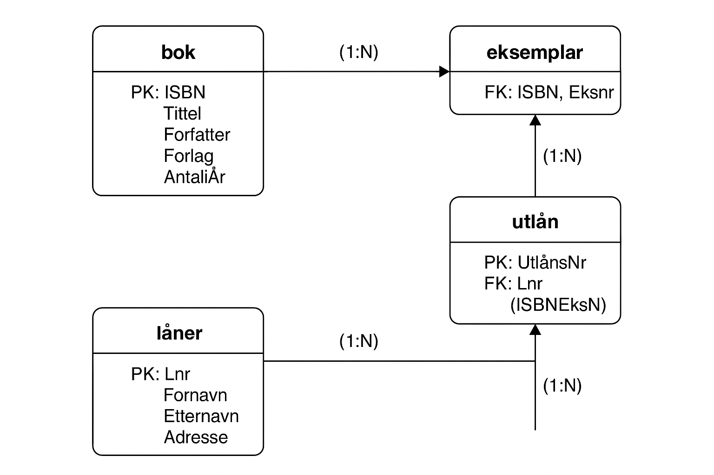

# 📘 Explanation of the Database Design (`ga_bibliotek`)

This database is created to manage a **small library system**.  
It keeps track of books, copies of those books, people who borrow them (*lånere*), and each loan transaction (*utlån*).  
The goal is to maintain **accurate and consistent information** using **primary keys**, **foreign keys**, and **constraints**.

---

## 1. Database Overview

The database contains four main tables:

| Table | Purpose |
|--------|----------|
| **bok** | Stores general information about books. |
| **eksemplar** | Stores physical copies of each book. |
| **låner** | Stores information about borrowers. |
| **utlån** | Stores details about each borrowing transaction. |

These tables are connected through **foreign keys** to ensure data integrity.

---

## 2. Table Descriptions

### 🟦 `bok`

Contains information about each book.

| Column | Datatype | Description |
|---------|-----------|-------------|
| `ISBN` | CHAR(10) | **Primary key.** Unique identifier for each book. |
| `Tittel` | VARCHAR(255) | Title of the book. |
| `Forfatter` | VARCHAR(100) | Author name. |
| `Forlag` | VARCHAR(100) | Publisher name. |
| `UtgittÅr` | SMALLINT UNSIGNED | Year of publication. Cannot be negative. |
| `AntallSider` | INT | Number of pages. Must be greater than 0. |

**Constraints used:**
- `PRIMARY KEY (ISBN)` — ensures each book is unique.  
- `NOT NULL` — prevents empty required fields.  
- `CHECK (AntallSider > 0)` — ensures the page number is realistic.

---

### 🟩 `eksemplar`

Contains information about **physical copies** of each book.

| Column | Datatype | Description |
|---------|-----------|-------------|
| `ISBN` | CHAR(10) | **Foreign key** referencing `bok(ISBN)`. |
| `EksNr` | INT | Copy number of the book (1, 2, 3...). |

**Constraints used:**
- `PRIMARY KEY (ISBN, EksNr)` — ensures each book copy is unique.  
- `FOREIGN KEY (ISBN)` REFERENCES `bok(ISBN)` — keeps copies linked to existing books.  
- `ON UPDATE CASCADE` — updates related copies if the ISBN changes.  
- `ON DELETE RESTRICT` — prevents deleting a book if copies still exist.

---

### 🟨 `låner`

Stores information about people who borrow books.

| Column | Datatype | Description |
|---------|-----------|-------------|
| `LNr` | INT AUTO_INCREMENT | **Primary key.** Auto-incremented borrower ID. |
| `Fornavn` | VARCHAR(50) | First name. |
| `Etternavn` | VARCHAR(50) | Last name. |
| `Adresse` | VARCHAR(255) | Borrower’s full address. |

**Constraints used:**
- `PRIMARY KEY (LNr)` — ensures each borrower has a unique ID.  
- `AUTO_INCREMENT` — automatically generates new borrower numbers.  
- `NOT NULL` — ensures borrower information is complete.

---

### 🟥 `utlån`

Contains information about each loan transaction.

| Column | Datatype | Description |
|---------|-----------|-------------|
| `UtlånsNr` | INT AUTO_INCREMENT | **Primary key.** Auto-incremented loan number. |
| `LNr` | INT | **Foreign key** referencing `låner(LNr)`. |
| `ISBN` | CHAR(10) | Part of **composite foreign key** referencing the borrowed book copy. |
| `EksNr` | INT | Part of **composite foreign key** referencing the borrowed book copy. |
| `Utlånsdato` | DATE | Date when the book was borrowed. |
| `Levert` | TINYINT(1) | Return status (0 = not returned, 1 = returned). |

**Constraints used:**
- `PRIMARY KEY (UtlånsNr)` — ensures each loan record is unique.  
- `FOREIGN KEY (LNr)` REFERENCES `låner(LNr)` — connects loans to valid borrowers.  
- `FOREIGN KEY (ISBN, EksNr)` REFERENCES `eksemplar(ISBN, EksNr)` — ensures loans only refer to existing copies.  
- `CHECK (Levert IN (0,1))` — only allows 0 or 1 as valid return values.  
- `ON UPDATE CASCADE` — keeps relationships consistent when keys change.  
- `ON DELETE RESTRICT` — prevents deleting borrowers or copies that still have loan records.

---

## 3. Relationships Between Tables

| Relationship | Type | Description |
|---------------|------|-------------|
| **bok → eksemplar** | One-to-Many (1:N) | One book can have several copies. |
| **eksemplar → utlån** | One-to-Many (1:N) | Each book copy can be loaned multiple times. |
| **låner → utlån** | One-to-Many (1:N) | Each borrower can have several loans. |

**Foreign keys maintain referential integrity**, ensuring that:
- You cannot create a copy for a non-existent book.  
- You cannot create a loan for a non-existent borrower or book copy.  
- Deleting parent records (like books or borrowers) is restricted if related data exists.

---

## 4. Data Integrity and Constraints

The database enforces several constraints to maintain valid and reliable data.

| Constraint | Purpose |
|-------------|----------|
| **PRIMARY KEY** | Ensures every record is unique. |
| **FOREIGN KEY** | Maintains links between tables. |
| **NOT NULL** | Prevents missing critical information. |
| **CHECK** | Validates logical values (e.g., `AntallSider > 0`, `Levert IN (0,1)`). |
| **AUTO_INCREMENT** | Automatically generates unique numeric IDs. |
| **ON UPDATE CASCADE** | Keeps references updated when parent keys change. |
| **ON DELETE RESTRICT** | Prevents deletion of records that are still referenced. |

Together, these constraints guarantee **consistency**, **accuracy**, and **logical data integrity** across all tables.

---

## 5. ER Diagram



### Diagram Explanation
- Each box represents a table.  
- **PK** = Primary Key, **FK** = Foreign Key.  
- Arrows represent the relationships between tables.  
- **(1:N)** means “one-to-many” — one record in the first table can relate to multiple in the second.

```text
DATABASE: ga_bibliotek
│
├── bok
│   ↳ Book information (title, author, year, publisher, pages)
│
├── eksemplar
│   ↳ Physical copies of each book
│   (linked to bok by ISBN)
│
├── låner
│   ↳ People who borrow books
│
└── utlån
    ↳ Records of each borrowing
    (linked to låner by LNr,
     linked to eksemplar by ISBN + EksNr)
```
## 6. Summary

This database:
- Organizes all book, borrower, and loan data efficiently.  
- Keeps all relationships correct using **foreign keys**.  
- Uses **constraints** to ensure clean, consistent, and logical data.  
- Provides a reliable foundation for queries such as:  
  *Which borrower has not yet returned a book* or *how many copies exist for a specific title.*